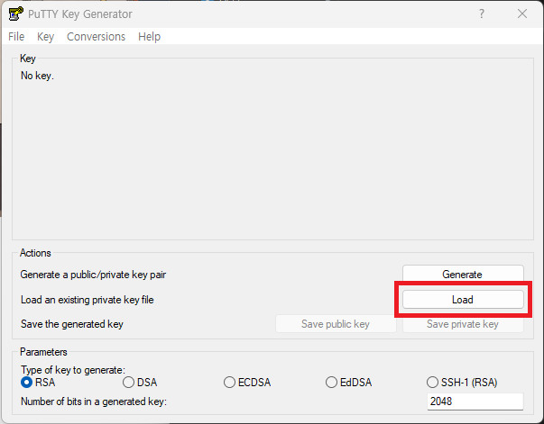
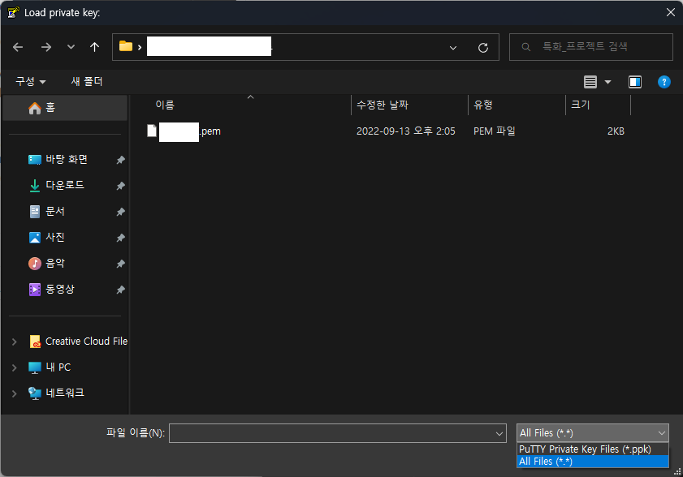
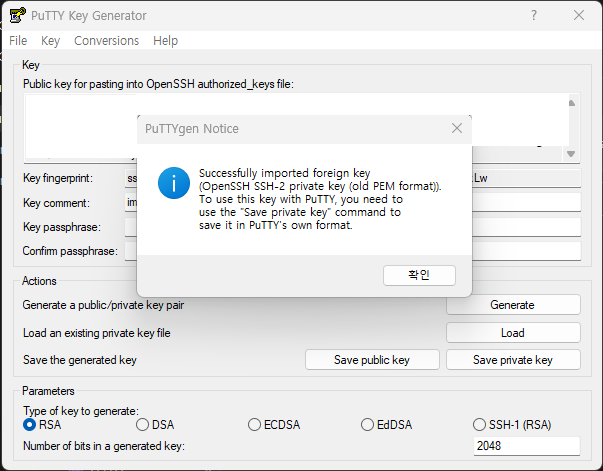
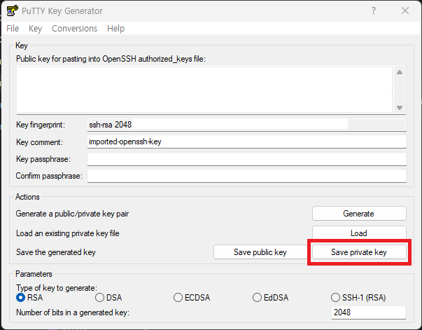
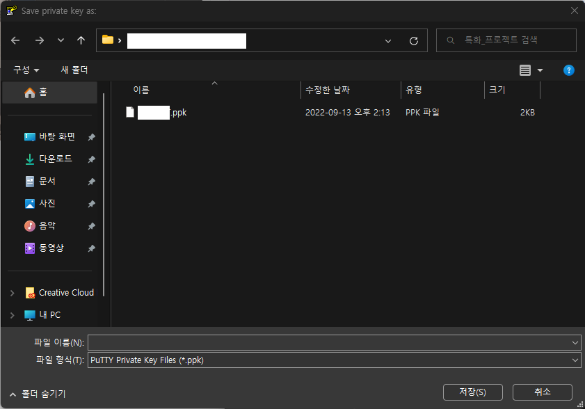
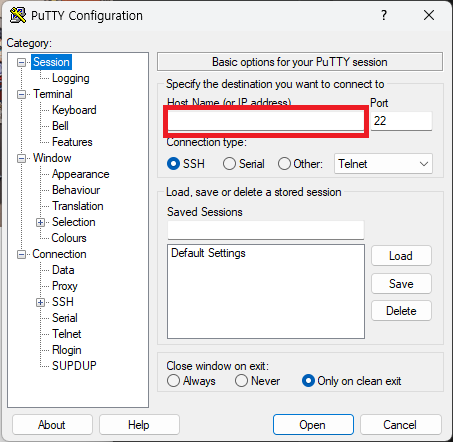
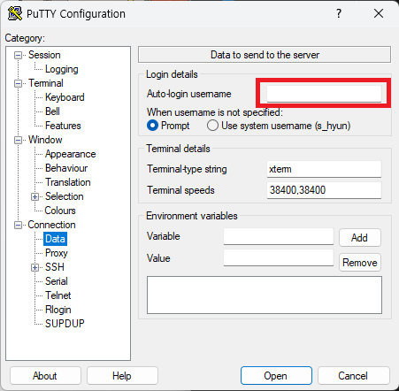
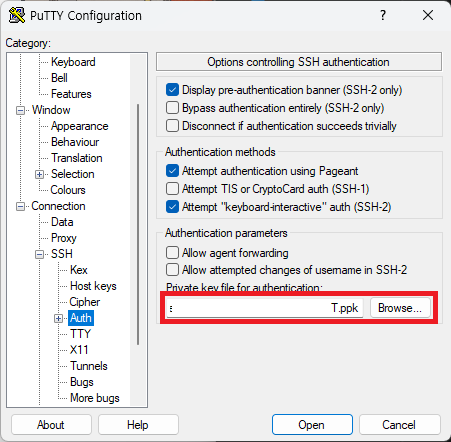
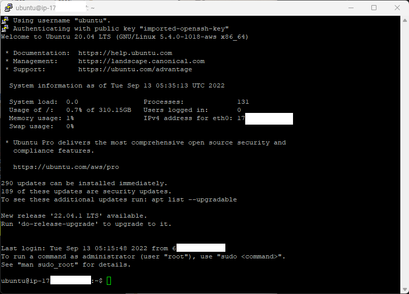

## PEM 파일이란?

-   AWS에서 서버 SSH에 접속을 위한 인증 방법으로 키 페어 생성을 통해 EC2 접근을 위한 개인키를 보관한 PEM 컨테이너 파일이다.

 

## Puttygen을 이용한 PEM 파일 PPK 파일로 변환하기

PEM 파일을 이용해 EC2 인스턴스에 접근하기 위해 개인키 파일 형식인 ppk로 추출해 변환을 해야 한다.

변환을 위해 먼저 putty에서 제공된 puttygen을 이용해 변환하는 과정을 알아보고자 한다.

먼저 puttygen을 실행한다.

다음과 같이 Load 버튼을 누르고

초기에 .ppk 파일만 보여주는데 모든 파일로 변경 후 .pem 파일을 불러온다.

다음과 같이 성공 메시지를 본다면 정상적으로 .pem 키를 가져왔다.

마지막으로 Save priavate key를 눌러 ppk 파일을 저장한다.

그럼 PEM 파일의 개인 키를 간단하게 추출해 변환했다.

 

## PPK 파일을 이용한 EC2 인스턴스 접속 putty 설정

putty를 실행해 Host Name 또는 IP adress를 입력한다.

Connection-Data에 로그인 username을 설정해 줄 수 있다.

Connection-SSH-Auth에 puttygen을 이용해 저장한 ppk 파일을 가져와 접속한다.

그럼 다음과 같이 정상적으로 접속된 모습을 확인할 수 있다.
